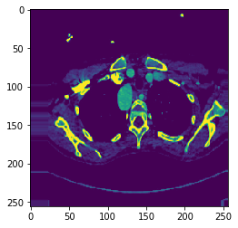
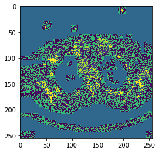
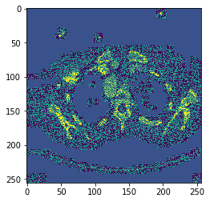
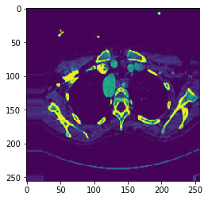

# Adversarial attack on Medical Image Segmentation

## 1. Acquiring signed gradients to create noise
### Based on: [fast gradient signed method (FGSM)](https://arxiv.org/abs/1412.6572)


### Run 
``` AdvImg.py```
### to generate noise (perturbations) 

### Sample outcomes: 

#### 1) Original Image: 



#### 2) Signed gradient acquired from AdvImg.py: 



#### 3) Adversarial Image with epsilon = 0.5 (advImg = origImg + epsilon * signedGrad)



#### 4) Adversarial Image with epsilon = 0.01




#### If epsilon is small, harder to fool model but the perturbation is hard to notice. Vice versa for bigger epsilon.
